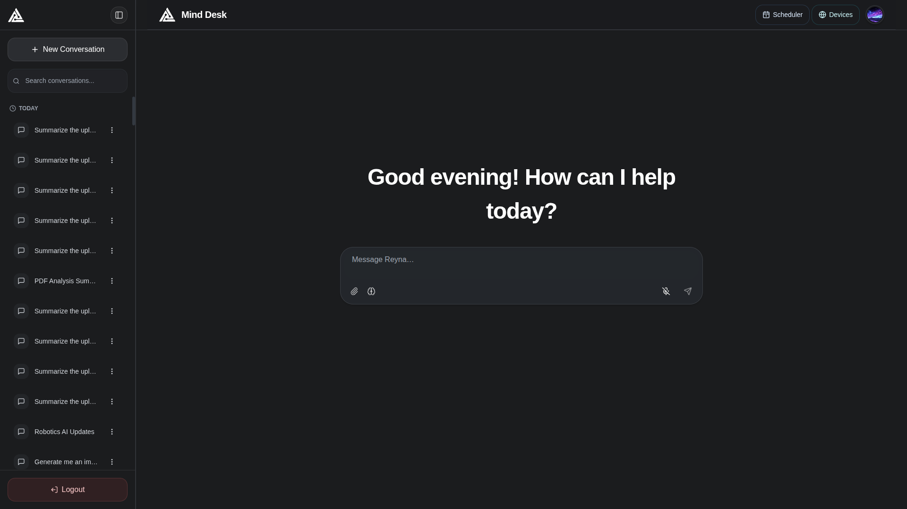
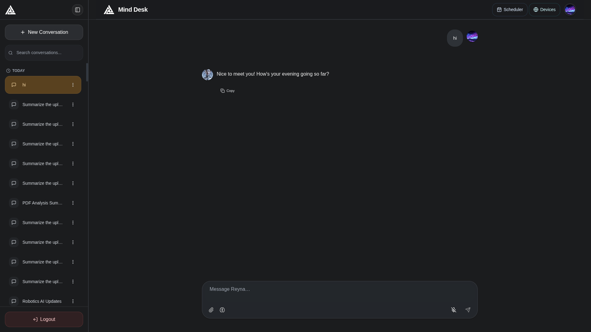
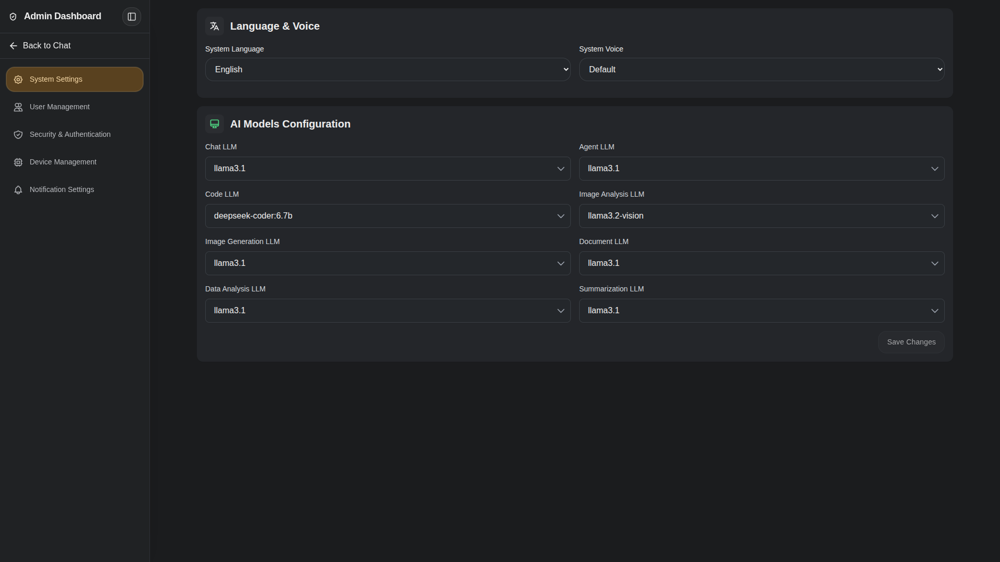
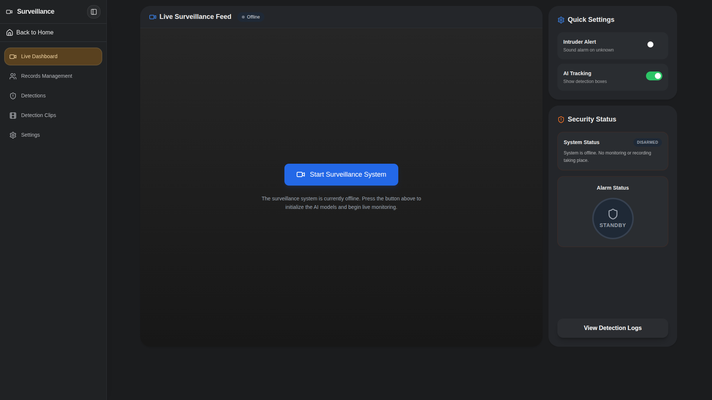
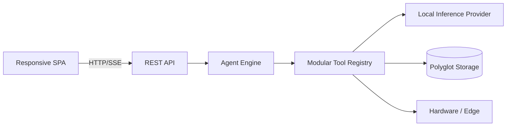

# MindDesk

### *Think it. Say it. Done.*

**A locally-hosted, multimodal agentic intelligence platform that plans, reasons, and acts.**

---

---

## Table of Contents

- [Overview](#overview)
- [System Demo](#-system-demo)
- [Engineering Highlights](#engineering-highlights)
- [Core Capabilities](#core-capabilities)
- [Architecture Preview](#architecture-preview)
- [Current Reference Implementation](#current-reference-implementation)
- [Documentation](#documentation)
- [Future Roadmap](#future-roadmap)

---

## Overview

MindDesk is a privacy-focused, locally-hosted AI platform designed to run entirely on private hardware. Unlike cloud-based wrappers, it never sends data to external servers. It employs a custom **Plan-and-Execute agent architecture** that decomposes complex requests, resolves dependencies, and dispatches actions across digital and physical domains.

This repository serves as an engineering case study demonstrating complex architectural design, multi-modal local inference, and polyglot persistence.

---

## 🎥 System Demo

Below is a demonstration of MindDesk's capabilities across conversation, document intelligence, device control, and scheduling.

> [!NOTE]
> MindDesk runs entirely on local hardware. To demonstrate the end-to-end functionality within a reasonable timeframe, processing times vary by task, waiting periods were shortened, and certain sections were accelerated in the video below. However, the outputs and system workflows shown were not modified and reflect actual execution.

<video src="https://drive.google.com/uc?export=download&id=1GVtCD-5pnohdx49q5A3DoXx5LhrLZNlD" poster="assets/demo/demo_thumbnail.png" controls="controls" style="max-width: 100%;">
  Your browser does not support the video tag.
</video>

---

## Engineering Highlights

- **Custom Plan-and-Execute Engine:** Bypasses basic tool-calling for deterministic fast-paths and multi-step model planning.
- **Autonomous Recovery:** Built-in 3-attempt execution retry loop utilizing the reasoning model to repair failed arguments.
- **Polyglot Persistence:** Architectural split between relational data, unstructured chat memory, and vector storage layers.
- **Decoupled Tool Registry:** Dynamic capability expansion without modifying the core agent orchestration. Currently supports 17 tools.
- **Local-First Constraints:** Inference, object detection, facial recognition, and embeddings run locally without cloud dependencies.

---

## Core Capabilities

MindDesk bridges 8 integrated capability domains via a single natural language interface:

1. **Conversational AI:** Persona-driven multi-turn chat and memory management.
2. **Document Intelligence (RAG):** Local vector ingestion and retrieval for PDF, DOCX, XLSX, and CSV files.
3. **Data Analysis:** In-memory tabular queries with automated chart generation.
4. **Vision & Generation:** Diffusion-based image creation and vision model analysis.
5. **Real-Time Surveillance:** Object detection and facial recognition using local cameras.
6. **Edge Device Control:** Natural language to serial commands for microcontroller integration (e.g., lighting, fans).
7. **Task Scheduling:** Natural language date/time extraction with calendar UI notifications.
8. **Administration:** Role-Based Access Control (RBAC) and audit logging.

---

## Architecture Preview

MindDesk employs a strict five-tier architecture decoupling the frontend, API routing, agent orchestration, service tools, and data persistence.

> [!NOTE]
> Current implementation technologies are documented separately.

*For an in-depth breakdown, see the [Architecture Document](docs/ARCHITECTURE.md).*

---

## Current Reference Implementation

While MindDesk is highly modular, the current reference implementation relies on the following technologies:

- **Frontend:** React 18, Tailwind CSS
- **Backend Routing:** Python Flask
- **Local Inference Provider:** Ollama
- **Planning Model:** Llama 3.1
- **Reasoning Model:** DeepSeek-R1
- **Vision Model:** Qwen 2.5 Vision / Llama 3.2 Vision
- **Embedding Model:** mxbai-embed-large
- **Computer Vision Pipeline:** YOLOv11, InsightFace
- **Relational Storage:** PostgreSQL (5 isolated schemas)
- **Document Storage:** MongoDB
- **Vector Storage Layer:** ChromaDB, FAISS
- **Tabular Analysis Engine:** DuckDB
- **Edge Microcontroller:** Arduino via Serial

---

## Documentation

Dive deeper into the engineering decisions and system designs:

- 🏗️ **[System Design](docs/SYSTEM_DESIGN.md):** Deep dive into the Planner, Executor, RAG pipeline, and engineering tradeoffs.
- 🗺️ **[Architecture](docs/ARCHITECTURE.md):** Component maps, deployment topology, and high-level structure.
- 🔌 **[Hardware Setup](docs/HARDWARE_SETUP.md):** Serial edge integration and IoT schematics.
- 🖼️ **[Gallery](docs/GALLERY.md):** Comprehensive visual tour of the user interface.

---

## Future Roadmap

- Containerization via Docker for easier deployment replication.
- Extension of the tool registry for API integrations.
- Further optimization of local inference hardware utilization.

---

Built as an engineering showcase.

