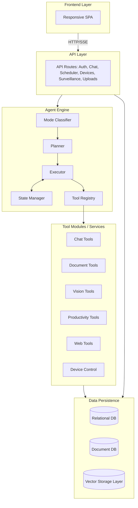
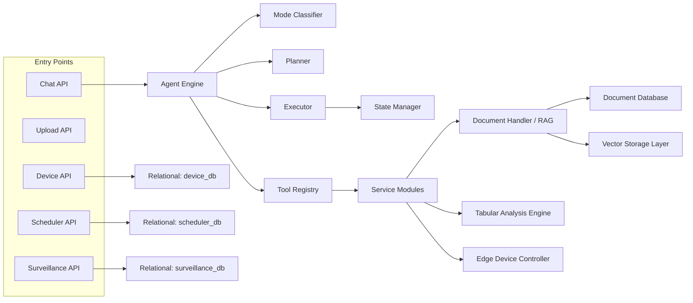

# Architecture — MindDesk

This document provides a high-level overview of the MindDesk architecture, separating the conceptual design from its current technical implementation. 

For an in-depth technical analysis of the Agentic execution, RAG pipeline, and engineering trade-offs, refer to the **[System Design Document](SYSTEM_DESIGN.md)**.

---

## Table of Contents

- [High-Level System Architecture](#high-level-system-architecture)
- [Component Dependency Map](#component-dependency-map)
- [Hardware Integration Architecture](#hardware-integration-architecture)
- [Current Reference Implementation](#current-reference-implementation)

---

## High-Level System Architecture

MindDesk is a modular, multi-modal AI platform built on a distinct **five-tier architecture**:

1. **Frontend Layer:** A responsive client application providing modular interfaces for Chat, Administration, Surveillance, and Task Scheduling. It communicates via RESTful HTTP calls and Server-Sent Events (SSE) for streaming responses.
2. **API Layer:** The central routing hub. It enforces Role-Based Access Control (RBAC), manages sessions, and routes domain-specific requests to backend services.
3. **Agent Engine:** The orchestration brain. Instead of simple query-response loops, it decomposes user requests into directed task graphs, manages a shared execution context, and implements an autonomous LLM-driven retry loop for error recovery utilizing a planning model.
4. **Service & Tool Modules:** Specialized modules mapping directly to system capabilities (e.g., Document retrieval, Edge Device communication). These act as execution boundaries for the Agent Engine.
5. **Data & Storage Layer:** A polyglot persistence strategy enforcing strict data isolation between relational databases, document databases, and vector storage layers.

> [!NOTE]
> Current implementation technologies are documented separately below.

---

## Component Dependency Map

The backend is modularized to ensure components remain decoupled. The Agent Engine orchestrates logic, while the Tool Modules handle specialized execution and storage interaction.

> [!NOTE]
> Current implementation technologies are documented separately below.

---

## Hardware Integration Architecture

MindDesk bridges software and hardware through dedicated interfaces, ensuring the core agent logic is unaware of physical hardware nuances.

- **Computer Vision Hardware:** Processed locally by the host machine to maintain privacy and reduce latency. The pipeline captures local camera feeds, which are processed by an Object Detection Model and a Face Recognition Model.
- **Edge Device Control:** External physical actions are routed through a dedicated edge microcontroller via serial communication, triggering physical relays based on string commands dispatched by the system.

---

## Current Reference Implementation

While MindDesk's architecture describes modular roles, the current reference implementation uses the following specific technologies:

- **Frontend Layer:** React 18 SPA, Tailwind CSS
- **API Layer:** Python Flask
- **Agent Planning Model:** Llama 3.1 (via Ollama)
- **Object Detection Model:** YOLOv11
- **Face Recognition Model:** InsightFace
- **Relational Storage:** PostgreSQL
- **Document Storage:** MongoDB
- **Vector Storage Layer:** ChromaDB, FAISS
- **Tabular Analysis Engine:** DuckDB
- **Edge Microcontroller:** Arduino