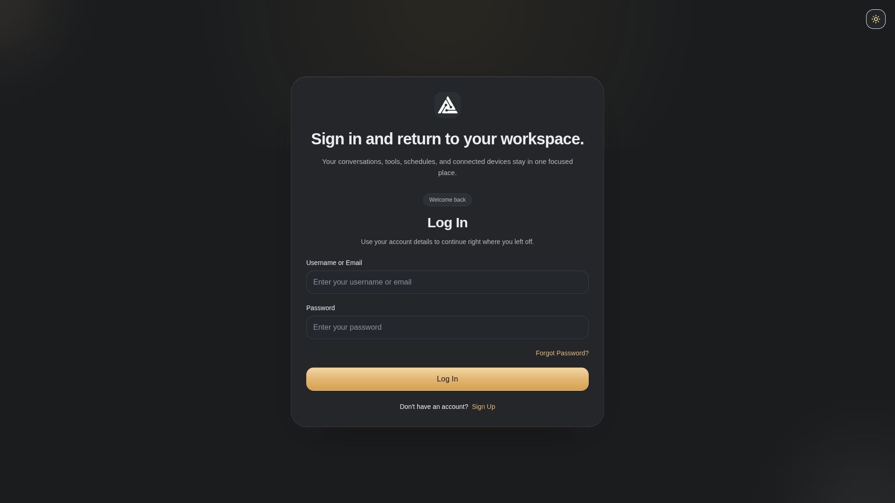
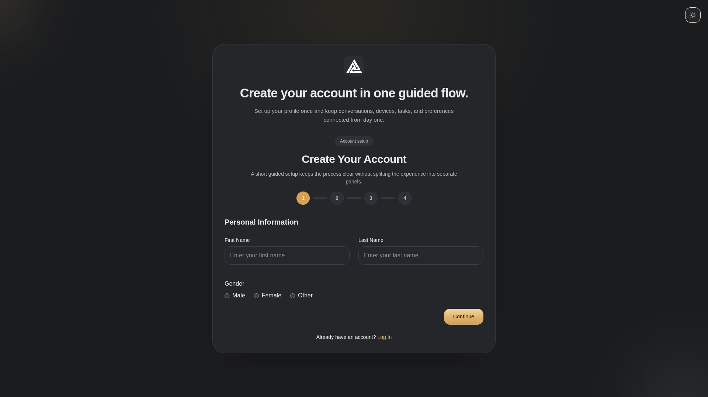
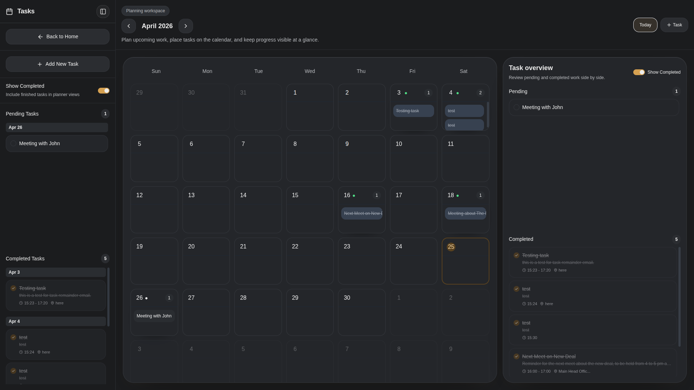
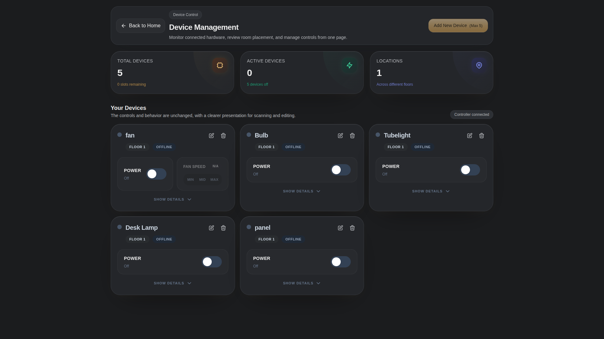
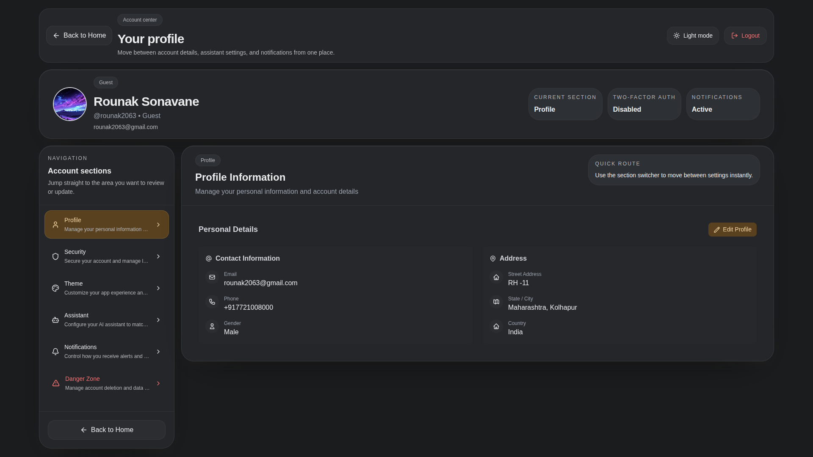
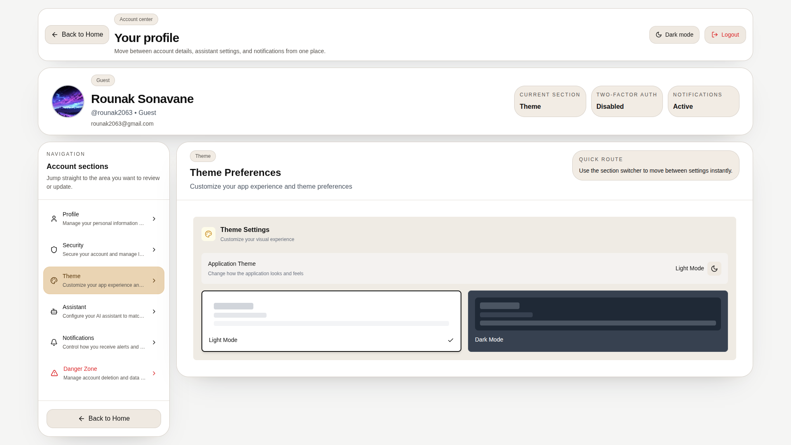

# Gallery — MindDesk

A visual walkthrough of the MindDesk platform interface and capabilities.

---

## Table of Contents

- [Authentication](#authentication)
- [Home](#home)
- [Conversations](#conversations)
- [Scheduler](#scheduler)
- [Device Control](#device-control)
- [Surveillance](#surveillance)
- [Administration](#administration)
- [Profile](#profile)
- [Themes](#themes)
- [Hardware Integration](#hardware-integration)

---

## Authentication

**Login** — Role-based authentication with session management.

---

**Signup** — New user registration with field validation.

---

## Home

**Home Interface** — Multi-modal input, document attachments, and system control tags.

---

## Conversations

**Chat & Memory** — Full message history with streaming markdown responses and execution logs.

---

## Scheduler

**Task Scheduler** — Calendar-based task management with natural language input scheduling.

---

## Device Control

**IoT Control Panel** — Registry of physical edge devices and interactive control interface.

---

## Surveillance

**Live Monitoring** — Real-time camera feeds, detection logs, facial recognition status, and alert scheduling.

---

## Administration

**Admin Dashboard** — User management, system configuration, RBAC controls, and login audit logs.

---

## Profile

**User Configuration** — Profile management and dynamic assistant persona tuning.

---

## Themes

**Theme System** — Seamless dark/light toggle with a unified accent palette.

---

## Hardware Integration

**IoT Control Board** — The microcontroller hardware array responsible for executing physical state changes triggered by the Agent Engine.

