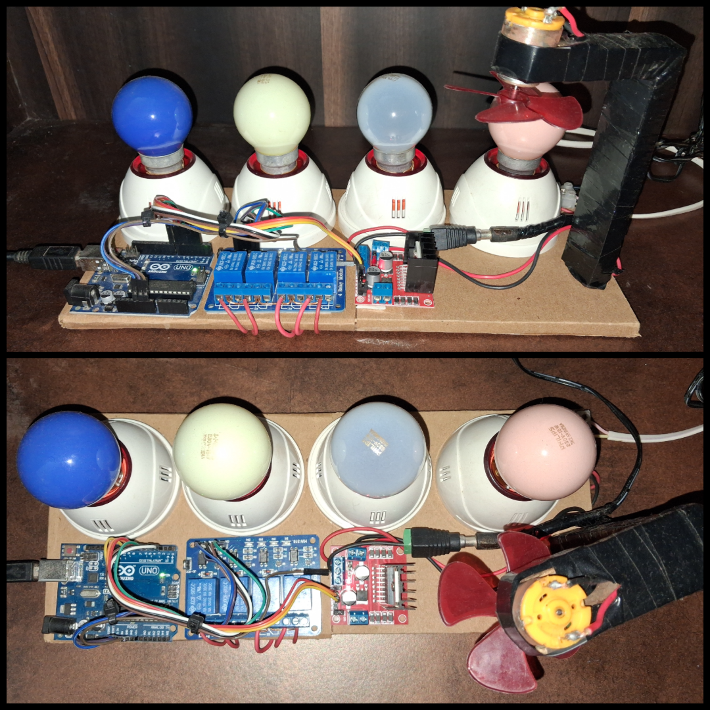

# Hardware Setup — MindDesk

MindDesk integrates seamlessly with external physical hardware to provide physical automation alongside its digital capabilities. This document outlines the setup, integration, and communication mapping for the IoT edge devices.

---

> [!IMPORTANT]
> **Hardware Scope Limitations**
> The edge microcontroller integrated into MindDesk is **strictly responsible for IoT device control**. 
> The microcontroller does **NOT** perform Computer Vision, Surveillance, Face Recognition, or Camera Processing. All AI inference and vision processing occur on the host machine's CPU/GPU.

---

## Table of Contents

- [1. Microcontroller Integration & Serial Communication](#1-microcontroller-integration--serial-communication)
- [2. Hardware Components](#2-hardware-components)
- [3. Device Mapping & Pin Configuration](#3-device-mapping--pin-configuration)
- [4. Visual References](#4-visual-references)
- [Current Reference Implementation](#current-reference-implementation)

---

## 1. Microcontroller Integration & Serial Communication

MindDesk communicates with the edge hardware via serial communication (e.g., `/dev/ttyACM0`). The `device_tools` module translates natural language intents from the agent into highly specific, delimited string commands that the microcontroller parses and executes.

### Serial Protocol
Commands are sent as structured strings. For example:
- **`ON:4`** (Turn ON the device on Pin 4)
- **`OFF:4`** (Turn OFF the device on Pin 4)
- **`SPEED:9:255`** (Set the motor speed on Pin 9 to 255)

The Python backend waits for an `ACK` response from the microcontroller to confirm execution before updating the physical state in the relational database.

---

## 2. Hardware Components

The primary hardware setup utilizes the following modules to safely control physical devices:

### Relay Modules
Used to control high-voltage or high-current AC/DC appliances (e.g., lights, panels).
- The microcontroller sends a 5V logical HIGH/LOW signal to the relay.
- The relay switches the actual load, keeping the microcontroller electrically isolated from mains voltages.

### Motor Driver (L298N or equivalent)
Used to control devices requiring variable power or polarity switching, such as DC fans.
- Connected to PWM-capable pins on the microcontroller.
- Allows the agent to interpret commands like "set fan to 50%" and send a mapped PWM value (`127`).

### Alarm Light Integration
The surveillance subsystem can automatically trigger physical feedback. If an intruder alert is activated on the host machine, a specific serial command is dispatched to trigger a designated alarm light or siren attached to a relay pin.

---

## 3. Device Mapping & Pin Configuration

The system uses a soft-mapping approach. The physical pins are registered in the relational database along with their location and device type, allowing the agent to query the database to determine which pin corresponds to a user's natural language request (e.g., "living room lamp").

### Pin Connections

| Arduino Pin | Connected Device | Function |
| :--- | :--- | :--- |
| `D2` | Relay Channel 1 | Appliance Control 1 |
| `D3` | Relay Channel 2 | Appliance Control 2 |
| `D4` | Relay Channel 3 | Appliance Control 3 |
| `D5` | Relay Channel 4 | Appliance Control 4 |
| `D6` | L298N ENA | Motor Speed Control (PWM) |
| `D7` | L298N IN1 | Motor Direction Control |
| `D8` | L298N IN2 | Motor Direction Control |

---

## 4. Visual References

### Control Board Setup

---

## Current Reference Implementation

The current reference implementation uses an **Arduino** board as the edge microcontroller to bridge MindDesk to the physical hardware.