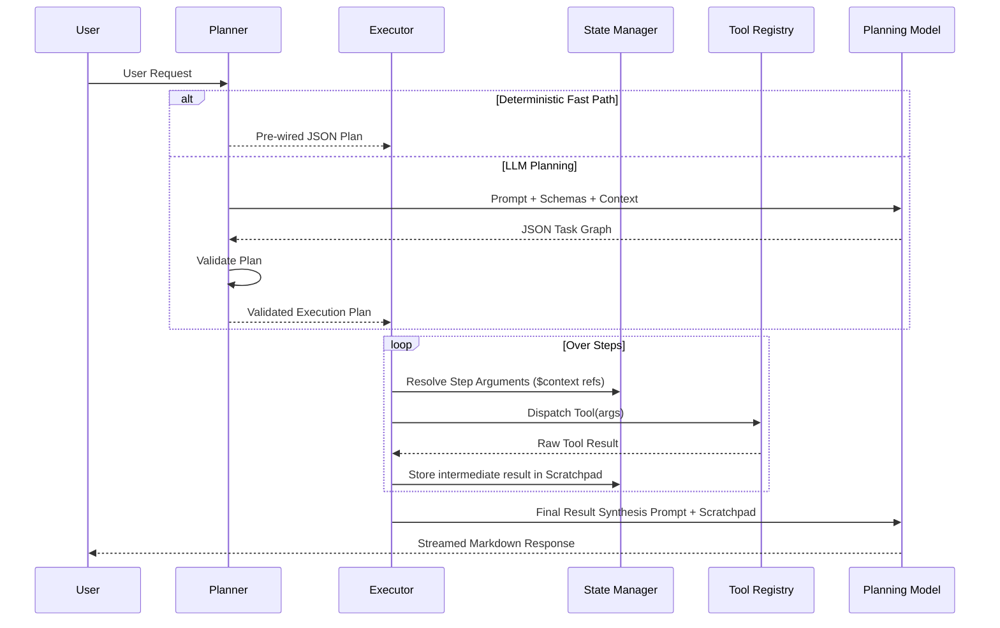
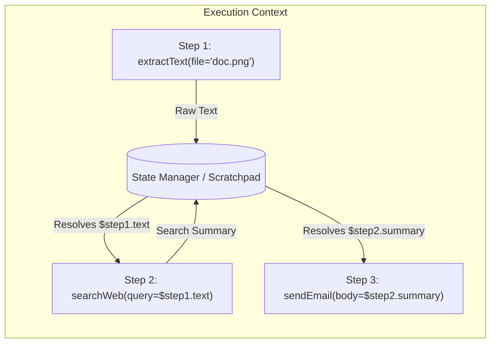
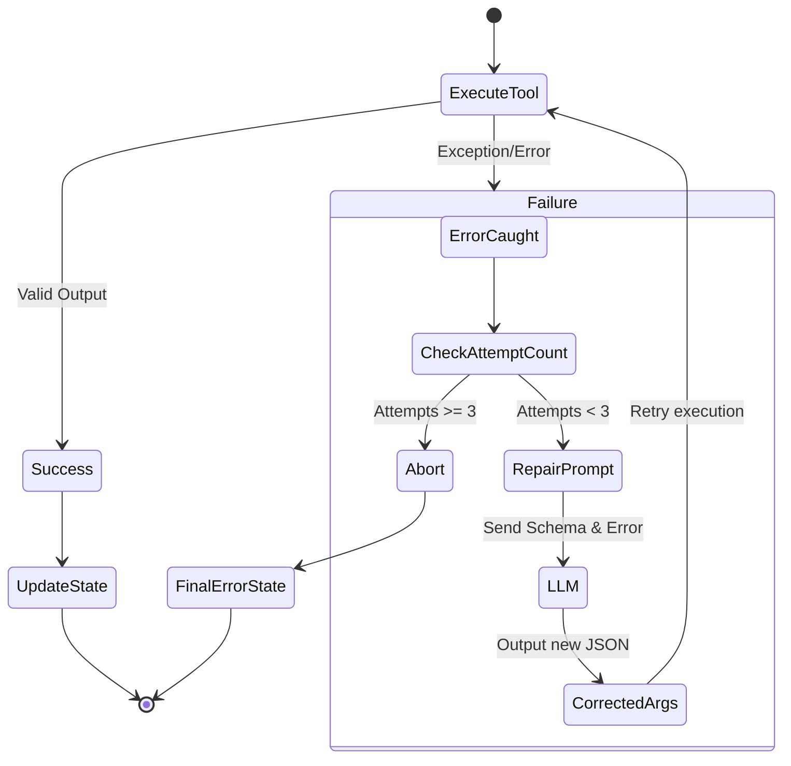
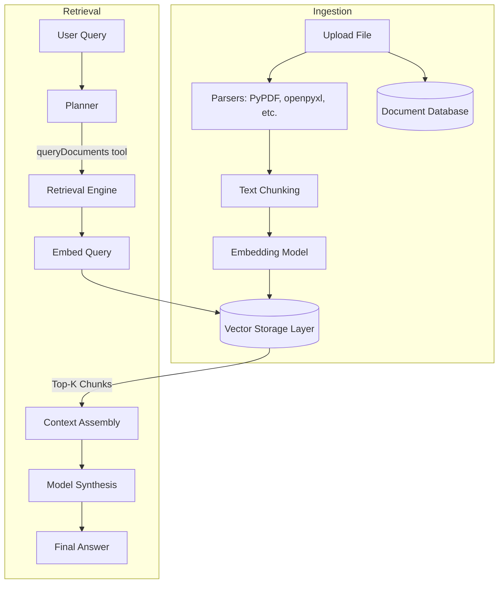
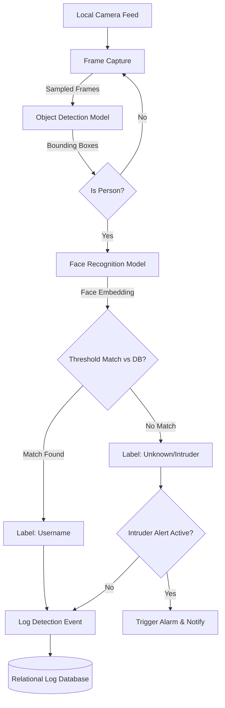

# System Design — MindDesk

MindDesk is built to prioritize data privacy and local execution without sacrificing the capabilities of a multi-modal AI assistant. This document details the technical design of its core subsystems.

---

## Table of Contents

- [1. Agentic Execution Engine](#1-agentic-execution-engine)
- [2. Modular Tool Registry](#2-modular-tool-registry)
- [3. Storage Architecture & Document Intelligence (RAG)](#3-storage-architecture--document-intelligence-rag)
- [4. Physical World Interaction](#4-physical-world-interaction)
- [5. Engineering Trade-offs](#5-engineering-trade-offs)

---

## 1. Agentic Execution Engine

MindDesk abandons standard single-turn text generation in favor of a **Plan-and-Execute** architecture. This enables multi-step workflows, predictable dependency chaining, robust error recovery, and seamless integration between software tasks and physical hardware control.

### The Planner
The Planner acts as the intent resolution and routing module. Upon receiving a user request, it constructs a directed task graph (JSON plan) to orchestrate multiple tools in sequence.

The Planner utilizes two routing mechanisms:
1. **Deterministic Fast Paths:** Hardcoded logic paths that trigger instantly based on regex/keyword matching. These bypass the language model entirely to maximize reliability and avoid probabilistic errors for critical systems (e.g., edge device control, simple retry commands).
2. **LLM Planning Path:** For multi-step or ambiguous workflows. The system passes the user prompt, tool schemas, and context to a local planning model. The model returns an ordered array of steps, managing dependencies across tools. A specialized reasoning model can be triggered via a `@reason` tag for complex logic.

### The Executor
The Executor acts as the runtime engine. It iterates through the Planner's JSON graph, resolving variables, executing the underlying code, and collecting results.

> [!NOTE]
> Current implementation technologies are documented separately below.

### Shared State & Memory
The Agent relies on a shared `context` dictionary passed between all modules.
- **Dependency Handling:** Tools output intermediate data. A downstream step references this via template variables (e.g., `$step1.text`). 
- **Argument Resolution:** Before dispatching a tool, the Executor injects live values from the in-memory `scratchpad`.
- **Memory Context:** The context object gathers the recent `N` turns of conversation history from the document database, user metadata, and file attachments, ensuring hyper-localized awareness before action.

### Autonomous Retry Loop
To handle brittle inputs or temporary failures, the Executor implements an autonomous self-correction loop.

1. **Detection:** If a tool raises an exception.
2. **LLM Repair Prompt:** The Executor feeds the exact exception message, the failed arguments, and the tool's schema back to the Planning Model.
3. **Correction & Retry:** The model outputs a corrected argument block and the Executor re-attempts the dispatch (maximum 3 attempts).

### Current Reference Implementation: Agent Engine
- **Local Inference Provider:** Ollama
- **Planning Model:** Llama 3.1 8B
- **Reasoning Model:** DeepSeek-R1
- **Conversation Memory Storage:** MongoDB

---

## 2. Modular Tool Registry

A foundational element of the Agent Architecture is the Modular Tool Registry, providing isolation between the orchestration engine and specific capabilities.

- **Isolation:** Every capability is a registered tool with typed inputs and declared outputs. The core agent requires no modifications when new tools are added.
- **Workflow:** A developer creates a function, adds a registration decorator (defining the JSON schema), and the tool is instantly available to the Planner.

MindDesk currently supports 17 discrete tools across 7 capability domains (Conversational AI, Document Intelligence, Data Analysis, Vision & Generation, Web Search, Productivity, and Device Control).

---

## 3. Storage Architecture & Document Intelligence (RAG)

MindDesk utilizes a polyglot persistence strategy enforcing strict data isolation.

### Storage Architecture
- **Relational Data:** Essential for ACID compliance, relational integrity, and strict schema enforcement.
- **Unstructured Data:** Ideal for flexible logs, dynamic configurations, and rapidly evolving metadata.
- **Vector Storage Layer:** Purpose-built for high-dimensional cosine similarity searches.

### RAG Pipeline
The Retrieval-Augmented Generation pipeline interrogates user-provided files securely.

- **Semantic Retrieval:** Documents (PDF, DOCX, XLSX, etc.) are parsed, chunked using an overlapping strategy, embedded using an Embedding Model, and stored in user-isolated vector indexes.
- **Synthesis:** When queried, the system retrieves the top-K relevant chunks via cosine similarity and restricts the synthesis model to answer strictly from those chunks to mitigate hallucination.
- **Tabular Data:** CSV/XLSX files bypass standard vector search. They are analyzed using a Tabular Analysis Engine to allow for mathematical aggregations and chart generation.

> [!NOTE]
> Current implementation technologies are documented separately below.

### Current Reference Implementation: Storage & RAG
- **Relational Data:** PostgreSQL (5 isolated schemas)
- **Unstructured Data:** MongoDB
- **Vector Storage Layer:** ChromaDB (primary), FAISS (fast direct indexing)
- **Embedding Model:** mxbai-embed-large
- **Tabular Analysis Engine:** DuckDB and Pandas

---

## 4. Physical World Interaction

MindDesk bridges text-based chat and physical automation.

### Real-Time Surveillance
The surveillance subsystem acts as an AI-driven security guard, operating completely locally.
- **Pipeline:** Captures camera streams, detects people using an Object Detection Model, extracts facial embeddings via a Face Recognition Model, and compares them against a database of known users.
- **Alerting:** If an unrecognized face is detected during an active window, it triggers an intrusion event, logs to the relational database, and pushes a UI notification.

> [!NOTE]
> Current implementation technologies are documented separately below.

### Device Control & Scheduling
- **Edge Device Control:** The system translates natural language commands ("turn off the fan") into hardware integration codes, tracking states persistently. 
- **Task Scheduling:** Extracts temporal data from requests, inserts records into the scheduler database, and uses a background daemon to issue alerts when due.

### Current Reference Implementation: Physical World
- **Object Detection Model:** YOLOv11
- **Face Recognition Model:** InsightFace `buffalo_l`
- **Edge Microcontroller:** Arduino via Serial

---

## 5. Engineering Trade-offs

- **Why a Custom Planner-Executor instead of Native Tool Calling?**
  Relying on simple native tool-calling limits observability and struggles with long dependency chains. A custom architecture allows the injection of explicit code validation, 3-attempt repair loops, and deterministic fast-paths for highly critical infrastructure.
- **Why Few-Shot Guidance Instead of Fine-Tuning?**
  Fine-tuning local models for every tool update is computationally prohibitive. Heavy in-context learning (few-shot prompting) enables instant updates to tool behaviors without retraining models, keeping the local deployment lightweight.
- **Why Deterministic Fast Paths?**
  Generative models are probabilistic. Hardcoding a fast-path for edge device control maximizes reliability for critical hardware actions, preventing the system from outputting the wrong JSON key or hallucinating an extra step.
- **Local-First Constraints:**
  Executing all inference, vision processing, and databases locally guarantees absolute data privacy. The trade-off is higher hardware requirements (RAM/GPU) and power consumption compared to cloud API wrappers.